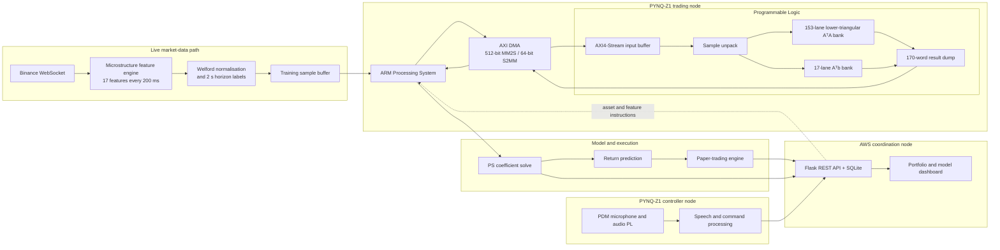
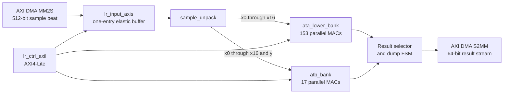

# FPGA-Accelerated Crypto HFT System

SystemVerilog RTL, PYNQ software, and cloud coordination for a real-time cryptocurrency research platform built around an **FPGA-accelerated online linear-regression engine**.

The trading node ingests live Binance market data, computes microstructure features, forms lookahead-safe training labels, and sends packed samples to a PYNQ-Z1. The programmable logic accumulates the normal-equation terms $A^T A$ and $A^T b$ using 170 parallel fixed-point multiply-accumulate lanes. The Processing System completes the regression solve, generates BUY/SELL signals, and records paper-trading results. A second PYNQ node provides voice-driven asset and feature control through a shared cloud API.

---

## Contents

- [FPGA-Accelerated Crypto HFT System](#fpga-accelerated-crypto-hft-system)
  - [Contents](#contents)
  - [Project status](#project-status)
  - [System architecture](#system-architecture)
  - [Why online linear regression](#why-online-linear-regression)
  - [FPGA accelerator architecture](#fpga-accelerator-architecture)
    - [Sample format](#sample-format)
    - [Result ordering](#result-ordering)
    - [AXI4-Lite register map](#axi4-lite-register-map)
  - [Formal verification](#formal-verification)
  - [Vivado and PYNQ-Z1 implementation](#vivado-and-pynq-z1-implementation)
    - [Latest routed results](#latest-routed-results)
  - [Running the project](#running-the-project)
    - [Formal-verification environment](#formal-verification-environment)
  - [Further documentation](#further-documentation)

---

## Project status

We target the **PYNQ-Z1 / Zynq-7020** using Vivado 2023.2.

The current accelerator provides:

- A 17-feature fixed-point regression datapath.
- 153 lower-triangular $A^T A$ accumulators.
- 17 $A^T b$ accumulators.
- 170 parallel 16-bit multiplier lanes.
- A sustained accumulation initiation interval of **one accepted sample per clock cycle**.
- A 512-bit AXI4-Stream input from DMA.
- A 64-bit AXI4-Stream result path back to DMA.
- AXI4-Lite control, status, sample-count, and cycle-count registers.
- Module-level SystemVerilog Assertions and SymbiYosys jobs for the principal control, data-movement, arithmetic, unpacking, and storage blocks.

The latest routed build is timing-clean at **100 MHz** with **+0.095 ns WNS** and a generated bitstream. The final coefficient solve remains on the ARM Processing System; the PL currently accelerates formation of the normal-equation matrices.

---

## System architecture



---

## Why online linear regression

For a design matrix $A \in \mathbb{R}^{n \times d}$ and target vector $b$, least-squares regression can be expressed through the normal equations:

$$
\hat{w} = (A^T A)^{-1} A^T b
$$

Appending one feature row $x$ with target $y$ does not require recomputing the matrix products over the full history:

$$
A'^T A' = A^T A + x^T x
$$

$$
A'^T b' = A^T b + x^T y
$$

The expensive repeated work is therefore a rank-one outer-product update. This maps naturally to a bank of parallel FPGA multiply-accumulate lanes and allows the design to retain historical sufficient statistics without storing every prior sample in PL memory.

For $d=17$, only the lower triangle of the symmetric $A^T A$ matrix is stored:

$$
\frac{17(17+1)}{2} = 153 \text{ terms}
$$

Together with 17 $A^T b$ terms, the fully parallel architecture contains **170 accumulator lanes**.

---

## FPGA accelerator architecture



A batch is controlled by the configured sample count. Once started, the input stage accepts up to one complete sample beat per cycle whenever downstream logic is ready. The 170 accumulators update together on every accepted sample. After the final sample has propagated through the input buffer, the top-level dump controller serialises the 17 $A^T b$ values followed by the 153 lower-triangular $A^T A$ values.

### Sample format

One 512-bit AXI4-Stream beat carries one signed fixed-point training sample.

| Bits | Field | Interpretation |
|---:|---|---|
| `15:0` | `y` | Signed 16-bit target value |
| `31:16` | `x[0]` | Signed 16-bit feature 0 |
| `47:32` | `x[1]` | Signed 16-bit feature 1 |
| `...` | `...` | Consecutive 16-bit feature fields |
| `287:272` | `x[16]` | Signed 16-bit feature 16 |
| `511:288` | Unused | Reserved and currently ignored |

The current RTL uses the configured sample count as the authoritative batch length. Incoming `TLAST` is present at the interface but is not currently used to terminate or validate the batch.

### Result ordering

The 64-bit output stream contains 170 signed accumulator values:

| Output index | Contents |
|---:|---|
| `0` to `16` | `Aᵀb[0]` to `Aᵀb[16]` |
| `17` to `169` | Lower-triangular `AᵀA`, row-major |

For matrix row $i$ and column $j$, where $0 \le j \le i < 17$, the lower-triangle index is:

$$
\operatorname{idx}(i,j) = \frac{i(i+1)}{2} + j
$$

The corresponding output-stream index is:

$$
17 + \operatorname{idx}(i,j)
$$

### AXI4-Lite register map

The latest Vivado block design maps the accelerator at `0x43C00000` and the AXI DMA at `0x40400000`.

| Accelerator offset | Name | Access | Description |
|---:|---|---|---|
| `0x00` | Control | R/W | Bit 0: start pulse; bit 1: clear pulse |
| `0x04` | Status | R | Bit 0: done; bit 1: busy |
| `0x08` | Number of samples | R/W | Batch length captured by the input controller |
| `0x0C` | Cycle count | R | Cycles for which the accelerator reports busy |
| `0x10` | Accepted sample count | R | Number of input samples accepted in the current operation |

The AXI4-Lite write implementation buffers address and data independently, so `AW` and `W` may arrive in either order. Read and write responses remain stable under backpressure.

---

## Formal verification

Module-level properties are included under `` `ifdef FORMAL `` and run through Yosys, SymbiYosys, SMTBMC, and an installed solver from the OSS CAD Suite.

The checked-in formal suite contains six jobs:

| Job | Main properties exercised |
|---|---|
| `lr_ctrl_axil.sby` | Independent `AW`/`W` arrival, one write per address/data pair, response stability, byte strobes, register decoding, start/clear pulses, and read backpressure |
| `lr_input_axis.sby` | Accepted-sample accounting, buffer stability, start/clear behaviour, backpressure, and completion sequencing |
| `sample_unpack.sby` | Exact target and feature bit-field extraction |
| `ata_lower_bank.sby` | Reset behaviour, enabled accumulation, valid timing, and representative lower-triangle mapping |
| `atb_bank.sby` | Reset behaviour, enabled accumulation, valid timing, and feature/target multiplication |
| `result_store.sby` | Dual-port memory write/read behaviour and address isolation |

Important AXI-Lite cover cases include address-before-data, data-before-address, simultaneous channel acceptance, stalled responses, partial writes, status reads, and rejected start attempts while busy.

Run the complete formal suite with:

```bash
cd linear_regression
source scripts/activate_oss_suite.sh
make -C formal
```

The Makefile saves successful proof artefacts under `formal/passed_tests/`, failed runs under `formal/failed_tests/`, and exits with an error if any job fails.

The current proof layer is intentionally module-level. A complete top-level proof of operation sequencing and the integrated 170-word result dump remains future work.

---

## Vivado and PYNQ-Z1 implementation

### Latest routed results

Reports are stored in [`hardware_report/`](hardware_report/).

| Item | Latest checked-in result |
|---|---:|
| Vivado version | 2023.2 |
| Target device | `xc7z020-clg400-1` |
| Clock period | **10.000 ns** |
| Clock frequency | **100.000 MHz** |
| WNS | **+0.095 ns** |
| TNS | **0.000 ns** |
| Unconstrained internal endpoints | **0** |
| Slice LUTs | **14,858 / 53,200 (27.93%)** |
| Slice registers | **21,516 / 106,400 (20.22%)** |
| Block RAM tiles | **6 / 140 (4.29%)** |
| DSP48E1 slices | **170 / 220 (77.27%)** |
| Estimated total on-chip power | **1.756 W** |

The power estimate has **medium confidence** because no simulation activity file was supplied. Most of the reported power belongs to the Processing System and DDR interfaces rather than the arithmetic array itself.

The worst setup path begins at a DSP48E1 product output and terminates in the upper portion of a 64-bit accumulator register. It contains a LUT followed by a 16-element CARRY4 chain, with a reported **9.618 ns data-path delay**. The current timing limit is therefore the product-to-wide-accumulator path, not the AXI input buffer.

---

## Running the project

### Formal-verification environment

Install the open-source verification tools using [`linear_regression/env_setup.md`](linear_regression/env_setup.md), then run:

```bash
cd linear_regression
source scripts/activate_oss_suite.sh
make -C formal
```

Clean generated formal artefacts with:

```bash
make -C linear_regression/formal clean
```

## Further documentation

- [`linear_regression/env_setup.md`](linear_regression/env_setup.md) — OSS CAD Suite installation and tool checks
- [`hardware_report/timing_summary.rpt`](hardware_report/timing_summary.rpt) — routed timing summary and detailed critical path
- [`hardware_report/critical_paths.rpt`](hardware_report/critical_paths.rpt) — top reported timing paths
- [`hardware_report/utilization.rpt`](hardware_report/utilization.rpt) — flat device utilisation
- [`hardware_report/utilization_hier.rpt`](hardware_report/utilization_hier.rpt) — hierarchical utilisation
- [`hardware_report/power_summary.rpt`](hardware_report/power_summary.rpt) — routed power estimate
- [`Real-Time FPGA-Accelerated Crypto High Frequency Trading System.pdf`](Real-Time%20FPGA-Accelerated%20Crypto%20High%20Frequency%20Trading%20System.pdf) — complete system report
